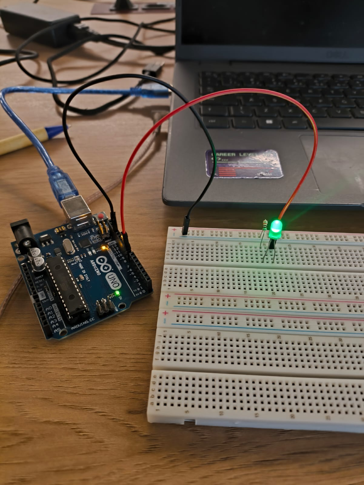

# Atividade: "Blink" com LED Interno do Arduino

## Objetivo
Esta documentação visa registrar a conclusão da **Entrega Parte 1** da atividade proposta, que consiste na instalação da Arduino IDE e na implementação do programa "Blink" utilizando o LED interno da placa Arduino, conforme o roteiro de autoestudos.

O programa deve fazer o LED interno acender, aguardar um tempo $X$, apagar, aguardar um tempo $Y$ e repetir o ciclo, gerando um efeito de luz piscando.

## Pré-requisitos
1.  Instalação da **Arduino IDE** no computador.
2.  Placa Arduino (modelo utilizado: *[Insira o modelo da sua placa, ex: Arduino Uno, Nano, etc.]*).
3.  Cabo USB para conexão da placa ao computador.

## Código-Fonte (Sketch)

O sketch abaixo foi carregado na placa para realizar a função "Blink". O tempo de acendimento e de espera (delay) foi configurado para **1000 milissegundos (1 segundo)**.

```cpp

void setup() {

  pinMode(LED_BUILTIN, OUTPUT);
}


void loop() {
  digitalWrite(LED_BUILTIN, HIGH);  
  delay(1000);                      // Aguarda 1000 milissegundos (1 segundo)
  digitalWrite(LED_BUILTIN, LOW);   // Desliga o LED (LOW é o nível de voltagem baixo)
  delay(1000);                      // Aguarda 1000 milissegundos (1 segundo)
}
```

## Escolha e Justificativa dos Componentes

| Componente/Software | Justificativa da Escolha |
| :--- | :--- |
| **Arduino IDE** | É o ambiente de desenvolvimento padrão (IDE) para a programação das placas Arduino. Sua simplicidade e a vasta comunidade de suporte facilitam o aprendizado inicial e o upload de código C/C++. |
| **Placa Arduino** | (Ex: Arduino Uno/Nano) Escolhida por ser a plataforma de prototipagem mais acessível e difundida. É robusta, possui um microcontrolador (MCU) fácil de programar e já inclui a porta USB para alimentação e comunicação serial. |
| **LED Interno (`LED_BUILTIN`)** | A escolha primordial. O objetivo da atividade é realizar o "blink" sem a necessidade de componentes externos (resistor, LED, protoboard), focando apenas na lógica de programação da placa. O LED interno já está conectado ao pino 13 (ou equivalente) da placa e possui o resistor de limitação de corrente integrado. |
| **Cabo USB** | Essencial para duas funções: 1. Alimentar a placa Arduino; 2. Estabelecer a comunicação serial para carregar o código (sketch) do computador para o microcontrolador. |

## Realização
As seguintes evidências demonstram o código no IDE, a placa conectada e o funcionamento do "Blink".

### 1. Screenshot da IDE e Código
Captura de tela da Arduino IDE mostrando o código completo e a interface de programação.


### 2. Fotografia do Arduino Ligado e LED Aceso
Fotografia da placa Arduino conectada ao computador via USB, com o LED interno aceso.


### 3. Vídeo do Funcionamento 
Vídeo que mostra o loop de piscar do LED interno, demonstrando o funcionamento contínuo e a cadência de 1 segundo (acesso) e 1 segundo (apagado).

[Clique aqui para acessar o video da demonstração.](https://drive.google.com/file/d/1Xbf6qRRu4Z9kcm8As7HFtvOYE3JWcn2H/view?usp=sharing)


---
# Atividade: Pisca-Pisca com LED Externo (Parte 2)

## Objetivo
Esta documentação registra a conclusão da **Entrega Parte 2**, que consiste na criação de uma simulação no **TinkerCAD** de um circuito pisca-pisca (`Blink`) utilizando componentes externos (`OFF_BOARD`). O objetivo é aplicar os conceitos de programação e entradas/saídas digitais (I/O) do Arduino em um circuito completo.

## Componentes Utilizados na Simulação
O circuito foi montado no TinkerCAD utilizando os seguintes componentes essenciais:

| Componente | Função no Projeto |
| :--- | :--- |
| **Placa Arduino Uno** | O microcontrolador principal, responsável por executar o código e controlar o pino de saída. |
| **Protoboard (Placa de Ensaio)** | Utilizado para organizar e facilitar as conexões elétricas entre o Arduino, o LED e o resistor, sem a necessidade de solda. |
| **LED (OFF\_BOARD)** | O componente de saída (atuador) que será acionado pelo comando digital do Arduino, criando o efeito de pisca-pisca. |
| **Resistor** | Essencial para limitar a corrente elétrica que passa pelo LED, protegendo-o contra queima (pois LEDs requerem uma corrente muito menor que a fornecida pelo Arduino). |
| **Fios de Conexão (Jumper Wires)** | Utilizados para realizar as ligações elétricas (conexões) no protoboard e entre o protoboard e o Arduino. |

## Princípio de Funcionamento
O LED externo foi conectado ao **Pino Digital 8** do Arduino (poderia ser qualquer pino digital, como 6, 9 ou 10, etc.). O programa define este pino como saída (`OUTPUT`) e alterna seu estado entre `HIGH` (ligado, 5V) e `LOW` (desligado, 0V), com um tempo de espera (`delay`) entre as mudanças, criando o efeito de pisca-pisca.

## Código-Fonte (Sketch do TinkerCAD)

O código abaixo foi obtido diretamente da simulação no TinkerCAD e carregado no microcontrolador virtual do Arduino Uno:

```cpp

void setup()
{
  pinMode(8, OUTPUT);

}

void loop()
{
  digitalWrite(8, HIGH);
  delay(1000); // Wait for 1000 millisecond(s)
  digitalWrite(8, LOW);  
  delay(1000);
}

```

## Realização do Projeto Pisca-Pisca

As evidências a seguir demonstram o projeto completo, desde a sua simulação no ambiente virtual até a montagem física final com componentes externos.

### 1. Simulação no TinkerCAD
Screenshot do ambiente de simulação no TinkerCAD, mostrando a montagem do circuito com Arduino, protoboard, LED e resistor, e o código aberto na tela.


### 2. Montagem Física (Real)
Fotografia da montagem física do circuito, com a placa Arduino conectada e o LED externo, protoboard e resistor ligados, demonstrando o funcionamento real do projeto.



### 3. Vídeo de Demonstração (Link do TinkerCAD)
O link abaixo permite a visualização e simulação direta do projeto no ambiente TinkerCAD, comprovando seu funcionamento sem erros.

[Link para o Projeto Pisca-Pisca no TinkerCAD](https://www.tinkercad.com/things/9zI3BCz5Jzx-terrific-kasi-amur)
